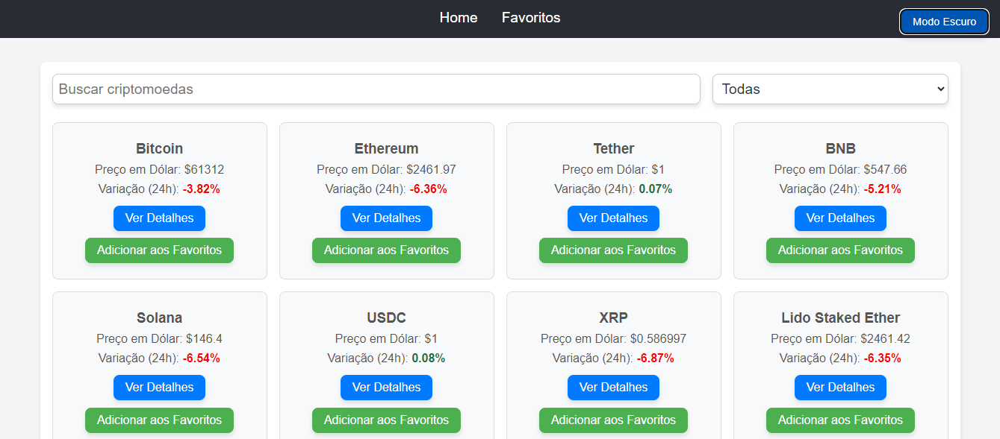
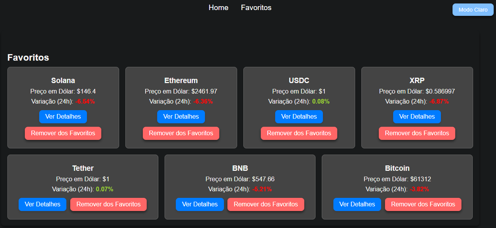

# CryptoTrack

Este projeto é um dashboard de cotações de criptomoedas desenvolvido com React, que consome a API do CoinGecko para exibir informações em tempo real sobre os preços e a variação de diversas criptomoedas. O projeto inclui um sistema de favoritos, filtros, pesquisa, gráficos e suporte a tema escuro.

## Imagens
<p align="center">
    

<p align="center">
    

## Funcionalidades

- **Listagem de criptomoedas**: Mostra uma lista de criptomoedas com preço atual e variação percentual das últimas 24 horas.
- **Sistema de favoritos**: Adicione e remova criptomoedas dos favoritos, com dados armazenados no `localStorage`.
- **Filtro e pesquisa**: Pesquise e filtre as criptomoedas por nome ou outras categorias.
- **Modo escuro**: Alterna entre temas claro e escuro.
- **Gráficos**: Visualize gráficos de variação de preço durante 7 dias.

## Tecnologias Utilizadas

- **React**: Biblioteca JavaScript para construir interfaces de usuário.
- **CoinGecko API**: API utilizada para obter os dados das criptomoedas.
- **CSS Modules**: Para estilização dos componentes.
- **localStorage**: Para salvar os favoritos do usuário.
- **Chart.js** Biblioteca de gráficos para exibir os gráficos de preço.

## Instalação

1. Clone o repositório:
   ```bash
   git clone https://github.com/ArthurCosta15/selecao-front-adasi-2024.git
2. Navegue até a pasta do projeto:
   ```bash
   cd selecao-front-adasi-2024
3. Instale as dependências:
   ```bash
   npm install
4. Inicie o projeto:
   ```bash
   npm start
5. Abra o navegador e vá até http://localhost:3000.